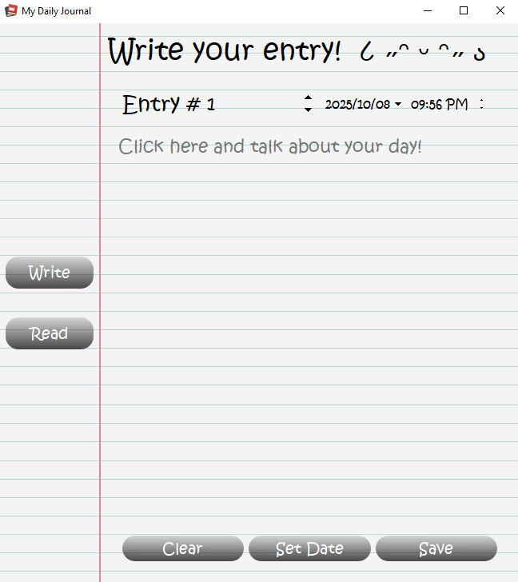
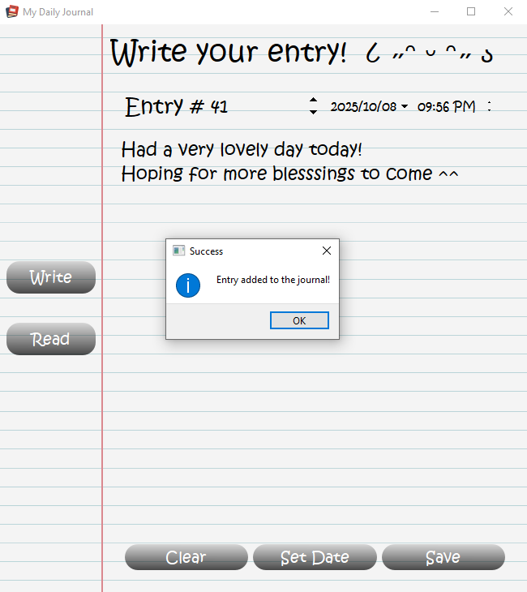
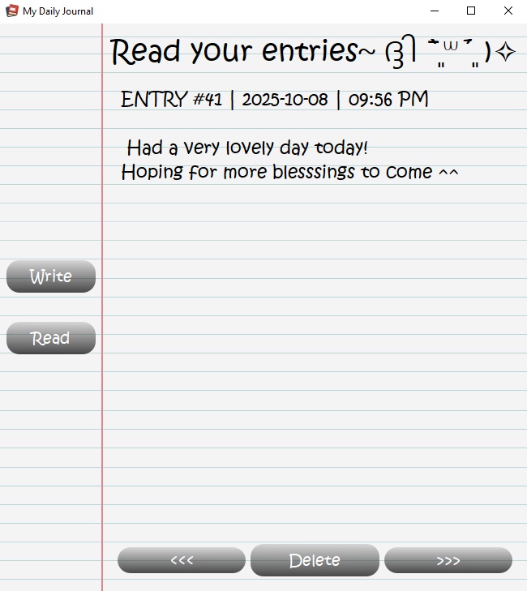
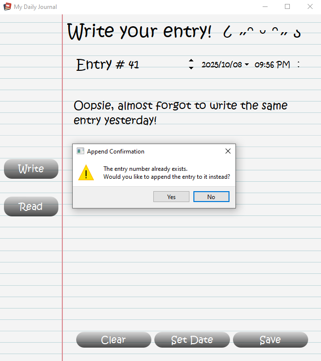
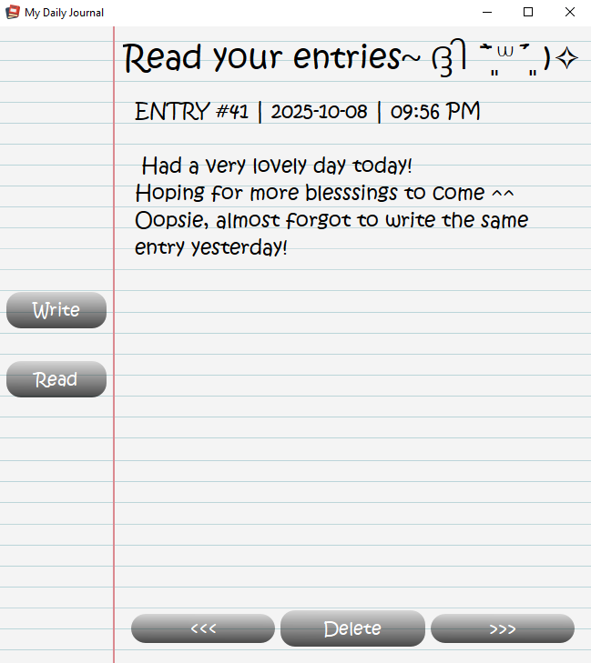
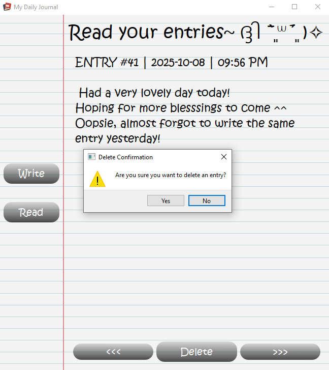
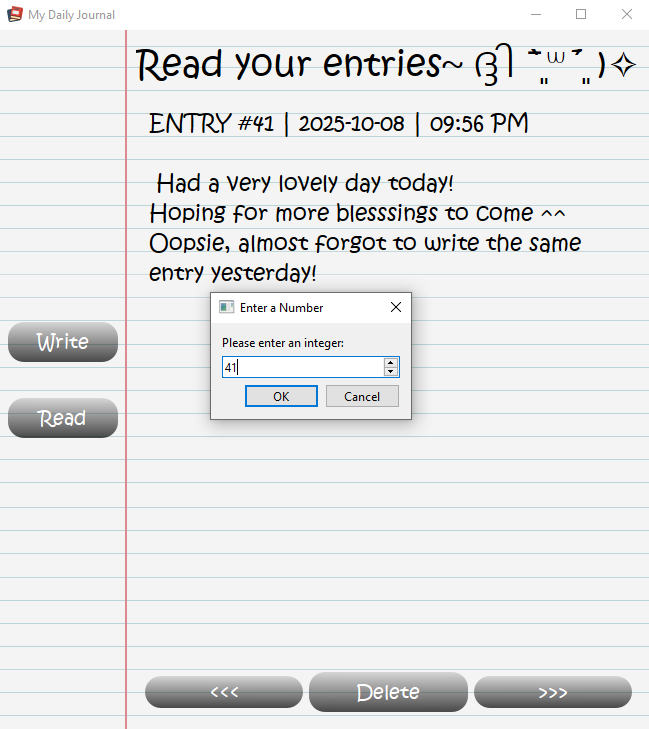

# MY DAILY JOURNAL
Made by Sam Vincent Joey D. Ortega - BSCS 

## Project Overview
This is a daily journal application that allows lets users to write entries about how their day went and the experiences that it offered them. This program was made in Python and uses PyQt6 for its graphical user interface.

## Features
This program has a write, read, delete, and append function.

#### ADDING and APPENDING
* When a user writes an entry, they are prompted to configure the entry number, date and time.
* When a user saves their entry. If the entry number does not exist in the database, it will be considered unique and is added as a new page in the read section.
* On the other hand, if the entry number DOES exist, the user is prompted to a choice whether to append the entry to the existing entry or not.

#### DELETING
* When a user wishes to delete an entry, the user is prompted to input an integer equal to the entry number they wish to delete.

## CODE STRUCTURE
main.py acts as the single entry point of the whole program, while repository.py and window.py acts as helper functions.
* main.py calls the method to openWindow() from window.py.
* window.py holds the functionalities of the buttons and general user interface.
* repository.py deals with the database and data.

## SCREENSHOTS








## HOW TO RUN THE PROGRAM
First, install all the requirements.
```
pip install -r requirements.txt
```

To run the app, simply type in your terminal:
```
python app/main.py
```